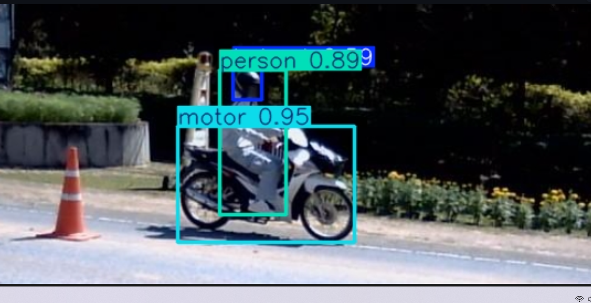
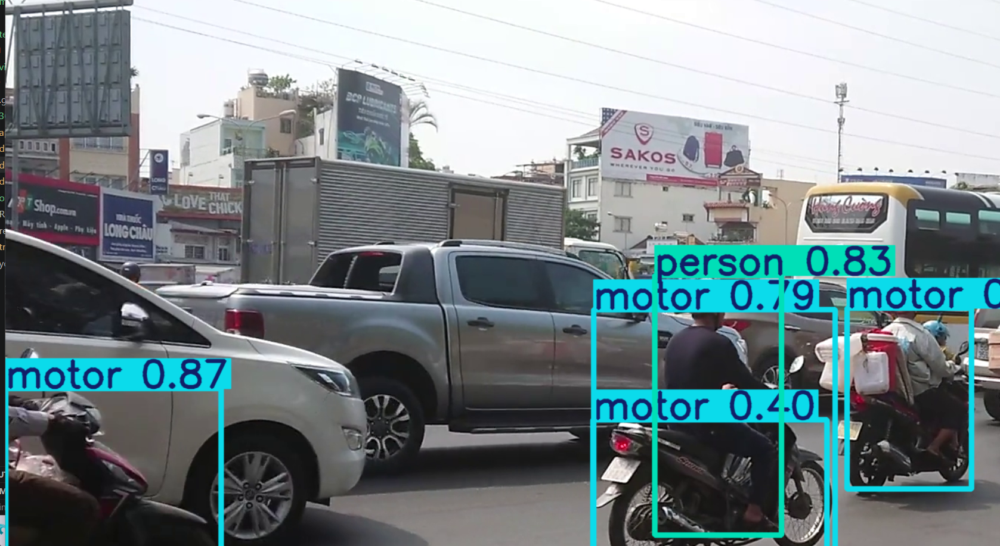

# 🪖 Helmet Detection System

An AI-powered Helmet Detection System built using **YOLOv8**, **Streamlit**, and **OpenCV**.

## Features

- 🖼️ Image Detection
- 🎥 Video Detection
- 📷 Live Webcam Detection
- 📊 Detection Summary
- 🎯 Adjustable Confidence Threshold
- ⚡ Real-Time YOLOv8 Inference

---

## Tech Stack

- Python
- YOLOv8 (Ultralytics)
- Streamlit
- OpenCV
- Pillow
- streamlit-webrtc

---

## Project Structure

```
YOLO-Project/
│
├── app.py
├── detect_image.py
├── detect_video.py
├── detect_webcam.py
├── models/
│   └── best.pt
├── requirements.txt
├── README.md
├── .gitignore
└── helmet_dataset/
```

---

## Installation

Clone the repository:

```bash
git clone https://github.com/YOUR_USERNAME/YOLO-Project.git
cd YOLO-Project
```

Install dependencies:

```bash
pip install -r requirements.txt
```

Run the application:

```bash
streamlit run app.py
```

---

## Features Demonstrated

- Image Detection
- Video Detection
- Webcam Detection
- Object Counting
- Helmet Detection
- No Helmet Detection

---

## Model

The project uses a custom-trained **YOLOv8** model trained on a helmet detection dataset.

Current classes:

- Helmet
- Motor
- No Helmet
- Person

---

## Future Improvements
- Improved dataset
- Higher model accuracy
- Rider-Helmet matching
- Vehicle tracking
- Violation screenshot capture
- License plate recognition
- Deployment on Streamlit Cloud

---

## Screenshots

### Image Detection



### Video Detection



---

## Internship Information

This project was developed as part of the AI Internship at **Codtech IT Solutions Private Limited**.

- **Intern ID:** CTTS162
- **Intern:** JAI KRISHNA S

---

## Author

JAI KRISHNA S
